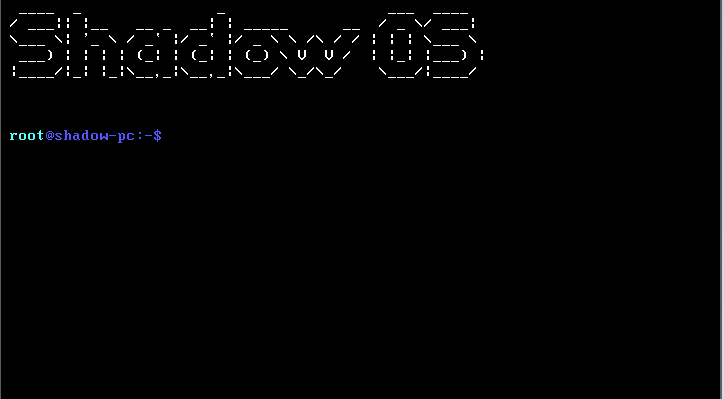
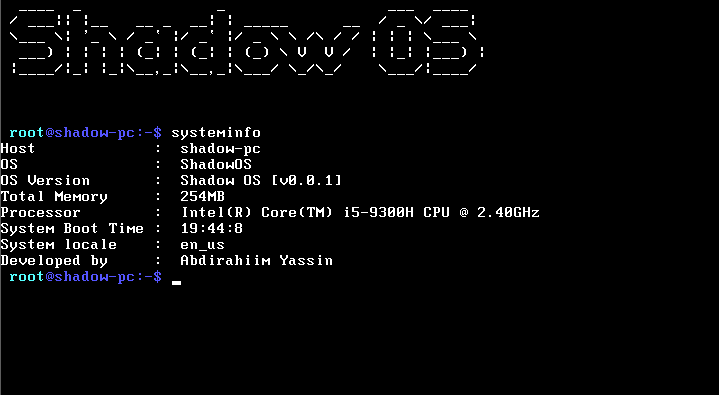
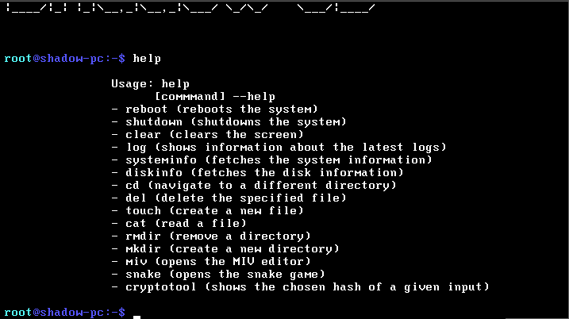


# Shadow OS

Shadow OS is a small simple operating system made in C# using Cosmos.

  

## Current Features

* Filesystem

* Crash handlers

* Crash/error logs

* Programs

* Multilanguage

  * Supports: 
    * American English 
    * Danish
    * Somaliland Somali

  

## Programs

* MIV: a simplistic VIM editor - developed by [@bartashevich](https://github.com/bartashevich) 

* Snake: a snake game - developed by [@bartashevich](https://github.com/bartashevich)

* CryptoTool - Hashing algorithms written by [@yuriks](https://github.com/yuriks) and the dewitcher Team, improved by the [Aura Team](https://github.com/aura-systems)

# Screenshots  

# Documention - still  in  progress

* User documentation

* Developer documentation
